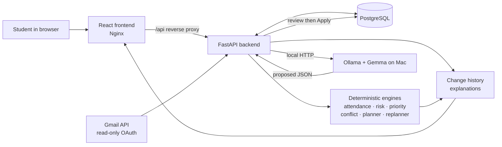

# CampusPulse architecture

CampusPulse separates interpretation from academic decisions. Local Gemma/Ollama can turn unstructured notices into a proposed structured change, but the backend's deterministic engines calculate attendance impact, risk, priority, conflicts, and study-plan changes.

## Data flow for a new notice

1. A student pastes a notice, uploads a PDF, or imports selected Gmail messages.
2. Gemma proposes structured fields such as course, date, type, and title.
3. CampusPulse stores this only as a **preview**. It changes no academic record yet.
4. The student reviews the preview and clicks **Apply**.
5. FastAPI writes the approved academic change, recomputes the dashboard, and records the reason in change history.
6. The deterministic planner/replanner uses the updated facts; the frontend shows the new risk, priority, and plan context.

The Gmail connection is optional. OAuth credentials and tokens stay on the developer's machine and are excluded from Git and the Docker image.
